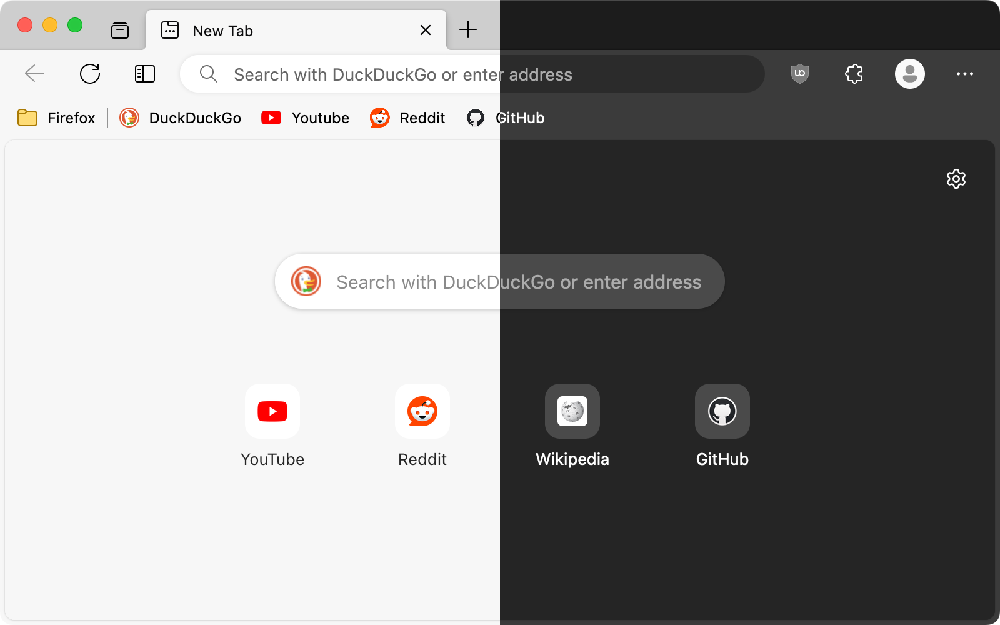

# PaperProton-Redux

A Firefox userChrome.css theme that aims to recreate the look and feel of Microsoft Edge.

_Screenshot: MacOS / Firefox 120 (Tweaks: Rounded Corners, Hide Forward Button)_

## How to Install

1. Go to `about:support` and click the "Open Folder/Show in Finder" button for the root directory of your browser profile.
2. Download the [latest release](https://github.com/sudo-zach/PaperProton-Redux/releases) and extract the files.
3. From the release folder, copy the `chrome` folder and `user.js` file into your Firefox profile folder.
4. Close and restart Firefox, if performed correctly, the theme should now be installed.
5. Optionally, listed below are some additional Firefox settings that can be changed using `about:config`:

| Description                                | Preference Name                                      | Value   |
| ------------------------------------------ | ---------------------------------------------------- | ------- |
| Use Edge-themed context menu on macOS      | `widget.macos.native-context-menus`                  | `false` |
| Use light theme in private browsing mode   | `browser.theme.dark-private-windows`                 | `false` |
| Use rounded bottom window corners on Linux | `widget.gtk.rounded-bottom-corners.enabled `         | `true`  |
| Use Windows accent colour in tabs toolbar  | `browser.theme.windows.accent-color-in-tabs.enabled` | `true`  |

Additional tweaks can also be applied to the theme such as Mica (Windows 11 Only), Floating Tabs and more. See [Tweaks](#tweaks).

**Note: Most Frequently Tested on Windows 11**

## Screenshots

| Theme                                                    | Light                                    | Dark                                   |
| -------------------------------------------------------- | ---------------------------------------- | -------------------------------------- |
| Default (Windows 11)                                     | ![Light][s-light]                        | ![Dark][s-dark]                        |
| Floating Tabs + Rounded Corners (Windows 11)             | ![Light, Floating Tabs][s-light-ft]      | ![Dark, Floating Tabs][s-dark-ft]      |
| Mica (Windows 11)                                        | ![Light, Mica][s-lm]                     | ![Dark, Mica][s-dm]                    |
| Mica and Floating Tabs (Windows 11)                      | ![Light, Mica and Floating Tabs][s-lmf]  | ![Dark, Mica and Floating Tabs][s-dmf] |
| Hide Tabs Bar + Rounded Corners + Sidebery theme (MacOS) | ![Light, Hide Tabs Bar][s-light-mac-htb] | ![Dark, Hide Tabs Bar][s-dark-mac-htb] |
| Rounded Corners (Linux, Ubuntu Yaru Theme)               | ![Light, Rounded Corners][s-light-linux] | ![Dark, Rounded Corners][s-dark-linux] |

## Tweaks

Certain tweaks can be applied to the theme, to enable them navigate to `about:config` and create a boolean key for each tweak you want to use and set it to `true`.

To disable a tweak, set the key to `false` or delete it.

### Floating / Rounded Tabs

Emulate the look of the rounded tabs feature available in Edge.

`uc.tweak.floating-tabs`

### Mica Toolbar Background <small>_(Windows 11 Only)_</small>

See [Mica Tweak Instructions][3] for installation instructions.

> **NOTE:**
> Only works on default theme: `System theme - auto`

`uc.tweak.win11-mica`

### Rounded Browser Corners

Add padding and rounded corners around the browser window, as seen in the newest redesign of Edge.

`uc.tweak.rounded-corners`

### Hide Tabs Toolbar

This hides the tabs toolbar when using a vertical tabs extension such as Sidebery, Tree Style Tab or Tab Center Reborn.

`uc.tweak.hide-tabs-bar`

Optionally, the window controls can be hidden from the navbar by using:

`uc.tweak.hide-tabs-bar.no-window-controls`

### Sidebery Theme

Enables the Sidebery extension sidebar theme, can be used with or without the hide tabs toolbar tweak. For a preview of the Sidebery theme, see the macOS screenshot in the [Screenshots](#screenshots) section.

#### Setup

Download and install [Sidebery][sidebery] from the Firefox addons store.

On Linux the colour theme may not work properly. To fix this, you can enable the "auto: dark/light" colour scheme option inside Sidebery (though this will disable the custom Firefox theme colours, and only use system light/dark colours).

To open the Sidebery settings page, find its icon in the toolbar or in the extensions menu, then right-click it and select 'Open settings'.

<b>Recommended Settings</b>

-   **Context Menu:**
    -   Use native context menu: 'on'
-   **Navigation Bar:**
    -   layout: 'horizontal' or 'hidden'
    -   **Bottom Bar of Tabs Panel:**
        -   Recently closed tabs: 'off'
        -   Bookmarks: 'off'
        -   History: 'off'
-   **Tabs:**
    -   Show new tab buttons: 'on' or 'off'
    -   **New Tab Buttons:**
        -   position: 'after tabs'
    -   **Position of New Tabs:**
        -   Place new tab opened from another tab: 'do not move it'
-   **Pinned Tabs:**
    -   Pinned tabs position: 'in panel - top'
    -   Show titles of pinned tabs: 'on' or 'off'
-   **Appearance:**
    -   Theme: 'proton'
    -   Color scheme: 'firefox'

 

Alternatively, you can import the provided `sidebery.json` configuration file, but this will restore Sidebery to the default settings before applying it.

`uc.tweak.theme.sidebery`

### Remove Extra Space at the Top of the Window

Removes the additional space at the top of the window above the tabs that appears when the window is not maximised. Enabling this will cause the tabs to touch the top edge of the window at all times.

`uc.tweak.disable-drag-space`

### New Tab Page Background Image

Adds a custom background image to the new tab page.

#### Required Setup:

- In your `chrome` folder, add an image with a filename of `background-0.(jpg/png)`.
- Optionally, add a second image named `background-1.(jpg/png)` this will be selected when the dark theme is enabled.

`uc.tweak.newtab-background`

### Hide Forward Button

Hides the forward button when it is not needed, as seen in Edge.

`uc.tweak.hide-forward-button`

### Hide Firefox Logo on New tab Page

Hide the Firefox logo + wordmark when on the new tab page.

`uc.tweak.hide-newtab-logo`

### Force Tab Colour to Match the Toolbar Colour

Removes the ability for custom themes to change the colour of the selected tabs, instead forcing them to match the toolbar colour. This can be useful when using themes designed for the Firefox's default Proton style.

(Left: **OFF**, Right: **ON**)

`uc.tweak.force-tab-colour`

### Vertical Context Navigation

Displays the navigation buttons (Back, Forward, Reload, Bookmark) in the right-click menu vertically like all the other menu items.

`uc.tweak.vertical-context-navigation`

### Hide Access Keys in Context Menu

Removes the underlining or highlighting of certain characters in the context menu. These underlines correspond to the key that when pressed, activates the item.

For example, "<ins>U</ins>ndo" becomes "Undo" and "Inspect (Q)" becomes "Inspect".

`uc.tweak.context-menu.hide-access-key`

### Remove Separators Between Tabs

Removes the vertical separating lines between the tabs, resulting in a cleaner look.

`uc.tweak.remove-tab-separators`

### Show Tab Close Button on Hover

When the tabs become too small, Firefox will hide the close buttons for non-active tabs to save space. This tweak will always display the close buttons when hovering over a tab.

`uc.tweak.show-tab-close-button-on-hover`

### Use Firefox's Default Context Menu Font Size

This reverts the custom font-size set on the context menu, only applies to Windows users.

`uc.tweak.smaller-context-menu-text`

### Disable Custom Context Menu

Disable the custom Edge-themed context menu and use the default Firefox menus.

`uc.tweak.revert-context-menu`

### Hide Firefox Account from App Menu

Hides the Firefox account menu item from the app menu (button with three dots), the Firefox account menu can still be accessed from the Firefox account button.

`uc.tweak.context-menu.hide-firefox-account`

### Hide "List All Tabs" Button

Removes the "List All Tabs" button located on the upper navigation bar beside the Window controls.

`uc.tweak.disable-list-all-tabs`

### Remove Homepage Text

Remove the website shortcuts text from the homepage and New Tab page.

`uc.tweak.disable-homepage-text`

### Remove Search Engines

Remove all the search engines from the search and url bar.

`uc.tweak.disable-search-engines`

### Compact Extensions Menu

Makes the unified extensions menu more compact, and closer to the design seen in Edge. This hides the permissions indicator label and makes the icons smaller.

`uc.tweak.context-menu.compact-extensions-menu`

### Improved App Menu

Removes the "Monitor", "Relay", "Mozilla VPN", and "Connected Devices" section from the Firefox application / account menu.

`uc.tweak.context-menu.improved-app-menu`

### Mica Tweak Instructions <small>_(Windows 11 Only)_</small>

1. Download and Install [Mica For Everyone][2].
2. Create a custom process rule with the following:
    1. Name: `firefox`
    2. Titlebar Color: `System`
    3. Backdrop Type: `Mica`
3. Enable tweak in `about:config`: `uc.tweak.win11-mica`
4. Restart Firefox.

## Acknowledgements

[muckSponge](https://github.com/muckSponge) - [MaterialFox](https://github.com/muckSponge/MaterialFox)

[Microsoft](https://github.com/microsoft) - [Fluent UI System Icons](https://github.com/microsoft/fluentui-system-icons)

<!-- links -->

[sidebery]: https://addons.mozilla.org/en-GB/firefox/addon/sidebery/
[2]: https://github.com/MicaForEveryone/MicaForEveryone
[3]: #mica-tweak-instructions-windows-11-only

<!-- light mode screenshot links -->

[s-light]: ./assets/screenshots/Windows_default_light.png
[s-light-ft]: ./assets/screenshots/Windows_floating-tabs_light.png
[s-lm]: ./assets/screenshots/light-mica.png
[s-lmf]: ./assets/screenshots/light-mica-floating-tabs.png
[s-light-mac-htb]: ./assets/screenshots/macOS_hide-tabs-bar_sidebery_light.png
[s-light-linux]: ./assets/screenshots/Linux_light.png

<!-- dark mode screenshot links -->

[s-dark]: ./assets/screenshots/Windows_default_dark.png
[s-dark-ft]: ./assets/screenshots/Windows_floating-tabs_dark.png
[s-dm]: ./assets/screenshots/dark-mica.png
[s-dmf]: ./assets/screenshots/dark-mica-floating-tabs.png
[s-dark-mac-htb]: ./assets/screenshots/macOS_hide-tabs-bar_sidebery_dark.png
[s-dark-linux]: ./assets/screenshots/Linux_dark.png
